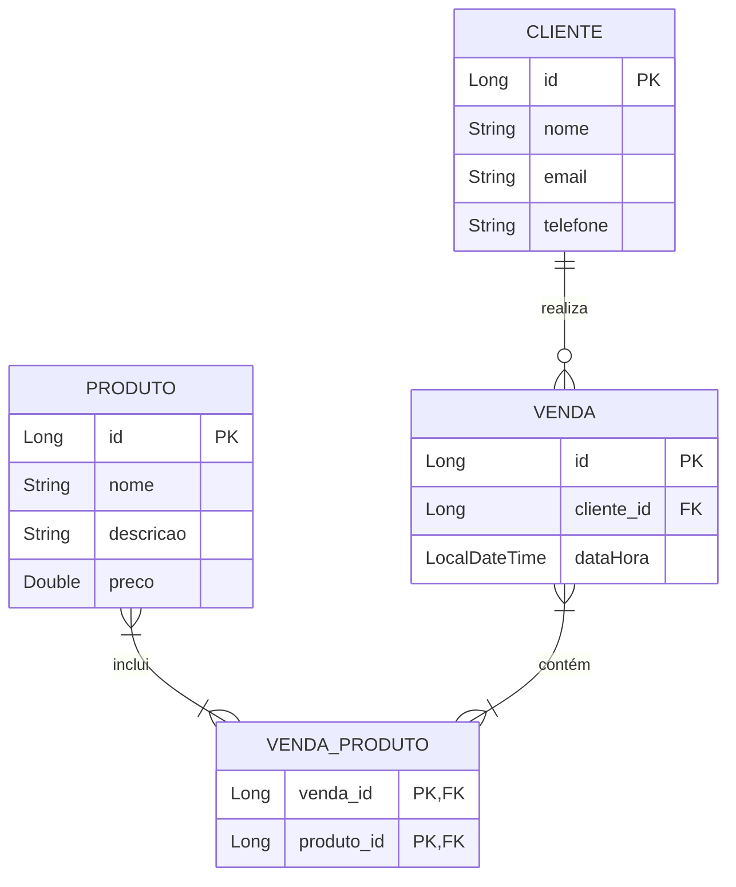

# Projeto: API Rest (Sistema de PDV)
Sistema de Frente de Caixa

## Esquema do banco de dados:

```mermaid
erDiagram
    CLIENTE {
        Long id PK
        String nome
        String email
        String telefone
    }

    PRODUTO {
        Long id PK
        String nome
        String descricao
        Double preco
    }

    VENDA {
        Long id PK
        Long cliente_id FK
        LocalDateTime dataHora
    }

    VENDA_PRODUTO {
        Long venda_id PK, FK
        Long produto_id PK, FK
    }

   CLIENTE ||--o{ VENDA : "realiza"
    PRODUTO }|--|{ VENDA_PRODUTO : "inclui"
    VENDA }|--|{ VENDA_PRODUTO : "contém"

```
